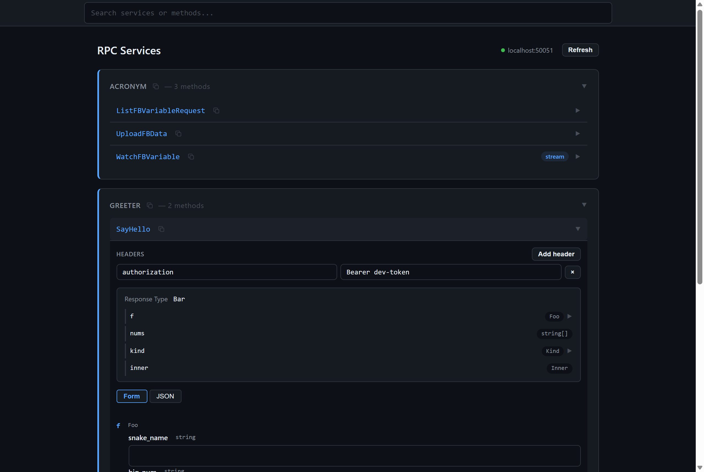
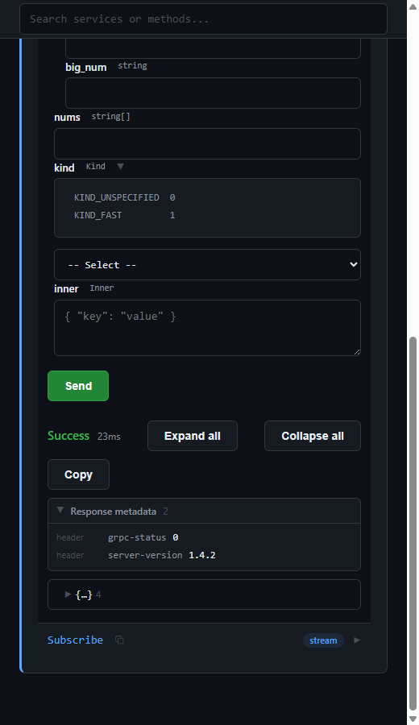
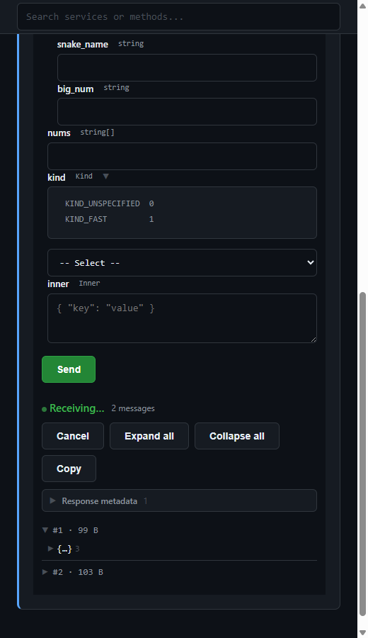
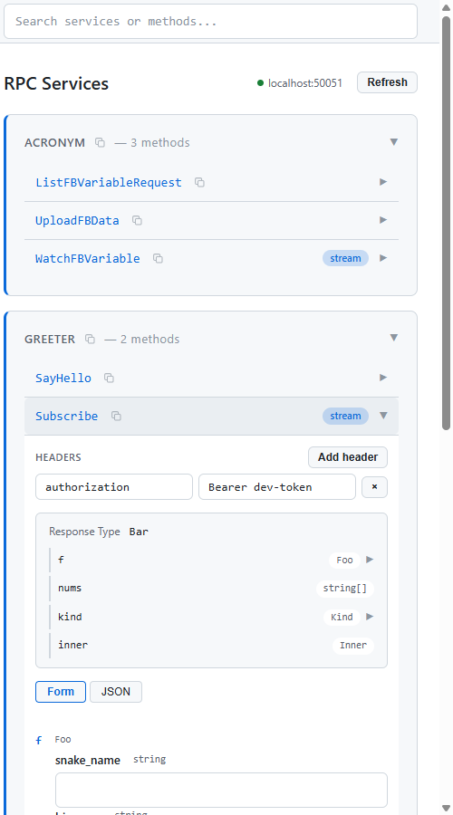

# Proto Utils

English | [中文文档](https://github.com/gp5251/proto_utils/blob/main/README.zh-CN.md)

An all-in-one Proto3 extension for VS Code: **syntax highlighting · go-to-definition · hover docs · TypeScript type generation · in-editor gRPC calls**.
Zero external dependencies — no need to install `protoc`, `buf`, or any CLI tools.

## Feature Overview

| Capability | Description |
| --- | --- |
| 🖋 **Language Services** | Proto3 syntax highlighting with distinct colors for built-in scalars vs. custom types |
| 🔍 **Go-to-Definition & Hover** | Type navigation within same file / imports / package namespace; hover shows type summary and leading comments |
| 🧭 **Outline Navigation** | `message` / `enum` / `service` / rpc methods all appear in Outline and Symbol Search |
| 🏗 **TS Type Generation** | `message` / `enum` / `repeated` / `map` / `oneof` → TypeScript; `service` → `<Name>Client` interface (all 4 streaming directions) |
| 📞 **RPC Workbench** | Auto-generated request forms from schema; invoke unary / server-streaming gRPC methods; collapsible response tree |
| 🔁 **Call Sequences** | Chain multiple rpc methods in sequence; later steps can reference earlier responses via `{{stepN.path}}` (data pipeline); named sequences persist to workspace |
| 🩺 **Live Diagnostics** | Inline syntax errors, missing types and duplicate names highlighted at reference sites; one-click import fix |

## Screenshots

### RPC Workbench

Auto-generated request form from proto schema: each field shows type badge, optional/required marker, and proto comments; nested messages and enums expand inline; Headers editor attaches metadata to calls.



### Unary Call · Collapsible Response Tree

Response data displayed in a DevTools-style collapsible tree; long strings truncated, int64 round-tripped as strings for precision; "Response metadata" section shows server headers/trailers.



### Server Streaming · Chunk-based Folding

Server streams displayed chunk-by-chunk with individual expand; cancellable at any time; long streams retain only the latest 200 chunks while showing the true total count.



### Light Theme

Workbench colors automatically follow VS Code light/dark theme (GitHub Dark for dark, GitHub Light for light).



## Quick Start

1. Open a workspace containing `.proto` files — the extension indexes automatically.
2. **Generate types**: right-click a `.proto` file → *Generate TypeScript Types*, or `Ctrl+Shift+P` to run batch generation.
3. **Call gRPC**: click the "▶ Call" CodeLens above any rpc method, fill the form and send — just point `protoUtils.runner.server` to your gRPC address and `protoUtils.runner.protoDir` to your proto directory in settings.

## Features

- Proto3 syntax highlighting for `.proto` files
- Distinct coloring for built-in scalar types vs. custom types
- Go-to-definition across same file, imported files, and package namespaces
- Hover on type references or definitions shows type summary (kind + qualified name) and leading comments
- Outline / symbol navigation: lists `message`, `enum`, `service`, and rpc methods under services
- Generates TypeScript types from `message`, `enum`, `repeated`, `map`, and `oneof`
- Generates `service` as client call interfaces (`<Name>Client`, streaming directions expressed with `AsyncIterable`)
- Auto-generates TypeScript `import type` from cross-file type references (`.ts` suffix by default; same-name types across modules get deterministic aliases)
- Single-file or batch generation for all protos
- "▶ Call" CodeLens above rpc methods opens the RPC Workbench with method pre-selected
- RPC Workbench: auto-generated request forms from proto schema; unary and server-streaming calls; responses shown in collapsible JSON tree (nested objects/arrays expand level by level)
- Call Sequences: chain methods for sequential execution, aborting on first failure; later steps can use `{{stepN.path}}` to reference earlier responses (preserving JSON types for whole values, string interpolation when embedded; server streams support `chunks[i]`); stream steps can be manually ended to continue; named sequences persist to `.proto-utils/sequences.json` for save/load/delete
- Diagnostics on `.proto` save or workbench load: syntax errors highlighted inline (narrowed to the offending token), missing types / duplicates flagged at reference and declaration sites; workbench error cards show red squiggles at error points

## Usage

### Editing and Navigation

After opening a `.proto` file in a workspace, the extension activates and indexes all Proto3 files.

- Syntax highlighting applies automatically.
- Hold `Ctrl` and click a type name to jump to its `message` or `enum` definition.
- On macOS, use `Cmd` + click.

Cross-file navigation requires the target type's file to be in the current VS Code workspace and resolvable via Proto `import` or package name.

### Generating TypeScript Types

Generate types via either method:

1. Right-click a `.proto` file in the editor or explorer, select **Proto Utils: Generate TypeScript Types** (current file only) or **Proto Utils: Generate TypeScript Types (All Protos)** (all protos including cross-file import targets).
2. Open Command Palette and run the same commands. For single-file command via palette, have the target `.proto` file open first.

By default, generated files are written to the workspace `generated/` directory. Given a proto file at `protos/account/user.proto` (with all protos under `protos/`):

```proto
syntax = "proto3";

package account.profile;

message User {
  string user_name = 1;
  repeated string roles = 2;
}
```

Default (`pathMapping: "file"`) output path:

```text
generated/user.ts
```

Generated content:

```ts
// Generated by proto-utils. Do not edit.

export interface User {
  userName: string;
  roles: string[];
}
```

Each generation run overwrites the output file — do not manually edit generated files.

#### Service Client Interface Generation

Each `service` generates a `<Name>Client` interface with method signatures inferred by streaming direction:

| RPC Type | Generated Signature |
| --- | --- |
| Unary | `(request: Req) => Promise<Resp>` |
| Server streaming | `(request: Req) => AsyncIterable<Resp>` |
| Client streaming | `(request: AsyncIterable<Req>) => Promise<Resp>` |
| Bidirectional streaming | `(request: AsyncIterable<Req>) => AsyncIterable<Resp>` |

Cross-file request/response types get auto-generated `import type` (with `.ts` suffix by default, disable via `protoUtils.codeGen.importExtension`); same-name types from different modules (e.g. two `ResponseStatus`) get deterministic path-based aliases to avoid duplicate identifier errors.

### Calling RPCs (RPC Workbench)

In `.proto` files, a "▶ Call" CodeLens appears above each rpc method. Clicking it opens the RPC Workbench with the method pre-selected. You can also run **Proto Utils: Open RPC Runner** from the Command Palette or right-click context menu to manually select service and method.

- Forms are auto-generated from the request message field schema; nested messages edit as JSON/JSON5 (supports comments, trailing commas, single quotes, unquoted keys).
- Unary call responses display in a collapsible JSON tree with nested objects/arrays collapsed by default, expandable level by level; long strings truncated; "Expand All / Collapse All" shortcut buttons included. Server-streaming responses fold by chunk, cancellable at any time; long streams retain only the latest 200 chunks of folded data and raw JSON (count remains true total), preventing unbounded memory/page growth. Raw JSON remains copyable. Stream methods support a "Max Messages" setting (default 100, `0` = unlimited) — auto-stops and shows "Complete" when limit reached.
- Response area includes a "Response metadata" collapsible section showing server headers and trailers (binary `-bin` keys displayed as base64); appears only when data exists.
- Proto file changes (save, external modification) auto-refresh the service list without losing form state.
- Search box uses fuzzy matching (subsequence, case-insensitive): `ldp` matches `ExecuteOpenLDProg`; substring matching still works.
- Client-streaming and bidirectional streaming not yet supported (see `docs/adr/0007`).
- Workbench UI colors follow VS Code light/dark theme automatically (GitHub Dark / GitHub Light fixed palettes, see `docs/adr/0011`).

#### Call Sequences (Execute Multiple Methods in Order)

The "Sequence" tab at the top of the workbench organizes multiple rpc methods into a sequential call chain:

- On the service page, expand a method and click "+ Add to Sequence" to append it with a snapshot of current input; the same method can be added multiple times (each with independent input); reorder or remove steps within the sequence.
- Each step's input uses the same form / JSON dual-mode editing as single method calls; steps are collapsed by default, expandable for editing.
- Per-step "Headers Override": merged by key over global `runner.metadata` at runtime — same key: step-level wins; different keys: appended.
- Stream receive limit: per-step "Max Messages" (default 100, `0` = unlimited); auto-ends the stream step (success) and advances to next when limit reached.
- Data pipeline: write `{{stepN.path}}` in later step inputs to reference step N's response, e.g. `{{step0.data.token}}`, `{{step0.chunks[1].data.id}}` (server streams by chunk index). When the placeholder occupies the entire value, the original JSON type is preserved; embedded in a string, it performs concatenation; if value is unavailable, that step fails and aborts the chain. Forward/self-references are flagged red at edit time.
- Server-streaming steps advance after natural end or clicking "End & Continue"; click "Stop" at any time to abort the entire chain.
- Any step failure (gRPC error / empty placeholder) aborts immediately, skipping remaining steps; pre-run validation checks all steps' methods still exist — invalid steps prevent launch and are named.
- Run report shows per-step status, duration, and response body (streams show each chunk); entire report copyable.
- Named sequences persist to workspace `.proto-utils/sequences.json` (version-controlled, team-shareable) with save / load / delete; persistence unavailable without an open workspace, but execution is unaffected.

Workbench settings:

| Setting | Default | Purpose |
| --- | --- | --- |
| `protoUtils.runner.server` | `"localhost:50051"` | gRPC server address (host:port) |
| `protoUtils.runner.protoDir` | `""` | Proto directory — **must point to the directory containing .proto files** (imports resolve relative to it; pointing to a parent causes cross-file type resolution failures); empty = workspace root; relative paths resolve against workspace folder. **When explicitly set, code generation also scans only this directory** |
| `protoUtils.runner.tls` | `false` | Use TLS channel (plaintext by default) |
| `protoUtils.runner.tlsRootCert` | `""` | Root certificate PEM path; empty = system default CA; relative paths resolve against workspace folder |
| `protoUtils.runner.tlsClientCert` | `""` | Client certificate PEM path (mutual TLS; must be paired with `tlsClientKey`) |
| `protoUtils.runner.tlsClientKey` | `""` | Client private key PEM path (mutual TLS; must be paired with `tlsClientCert`) |
| `protoUtils.runner.metadata` | `[]` | Default request headers for every call, one `"Key: Value"` per line; workbench Headers editor can add/remove before each call |
| `protoUtils.runner.timeoutMs` | `15000` | Unary call timeout (ms) via gRPC deadline; `0` = unlimited. Server streams are always unlimited |
| `protoUtils.runner.connProbeIntervalMs` | `5000` | Connection auto-probe interval (ms); `0` = disable periodic probing (probe only on open/refresh/manual "Refresh Services") |

#### TLS, Headers & Timeout

- **TLS**: enabling `runner.tls` creates a channel with `createSsl` semantics — configuring only `tlsRootCert` gives one-way TLS; additionally pairing `tlsClientCert`/`tlsClientKey` enables mutual TLS (providing only one causes an error at call time). PEM paths support absolute or relative to workspace folder.
- **Headers (metadata)**: entries in `runner.metadata` serve as initial values for each method's Headers editor; changes in the editor affect subsequent calls only, not written back to settings. Lines with empty keys are discarded.
- **Timeout**: unary calls return `DEADLINE_EXCEEDED` after `timeoutMs` without response (0 = unlimited); server streams are unaffected and can be cancelled manually at any time.
- **int64 round-trip**: `int64`/`uint64`/`sint64`/`fixed64`/`sfixed64` fields round-trip as strings (text input in forms, string in responses) to avoid truncation beyond 2^53; fill decimal strings on the request side. 32-bit integers remain numbers.

**Migrating from rpc_runner**: copy `server` and `protoDir` values from `rpc.config.json` to the VS Code settings above. `port` and `generatedDir` are removed (no more HTTP server or proto-loader-gen-types generation). The workbench and gRPC dependencies (@grpc/grpc-js) use lazy loading — loaded only on first workbench open, not affecting extension activation speed.

After modifying `protoUtils.runner.*` settings, the next call/refresh uses the new configuration without reopening the workbench (since 0.3.44; the server address in the top bar updates after panel reopen).

## Configuration

Search `Proto Utils` in VS Code Settings, or configure `protoUtils.codeGen.*` in workspace `.vscode/settings.json`.

| Setting | Type & Options | Default | Purpose |
| --- | --- | --- | --- |
| `protoUtils.codeGen.outputDir` | `string` | `"generated"` | Output directory, relative to workspace root |
| `protoUtils.codeGen.enumStyle` | `"enum"` \| `"union"` | `"enum"` | Generate Proto enums as TypeScript enums or string literal union types |
| `protoUtils.codeGen.optionalMessageFields` | `boolean` | `true` | Add `?` to non-repeated message-type fields |
| `protoUtils.codeGen.optionalScalarFields` | `boolean` | `false` | Add `?` to scalar fields |
| `protoUtils.codeGen.fieldNaming` | `"camelCase"` \| `"preserve"` | `"camelCase"` | Convert field names to camelCase or preserve original Proto names |
| `protoUtils.codeGen.pathMapping` | `"file"` \| `"package"` | `"file"` | Output path mapping: mirror directory structure relative to proto common root, or use package statement |
| `protoUtils.codeGen.importExtension` | `"ts"` \| `"none"` | `"ts"` | Whether generated import paths include `.ts` suffix |
| `protoUtils.codeGen.oneofStyle` | `"optional"` \| `"union"` | `"optional"` | Generate oneof as optional fields or discriminated union types |
| `protoUtils.codeGen.int64Style` | `"number"` \| `"bigint"` \| `"string"` | `"number"` | TypeScript mapping for 64-bit integer types (int64/uint64/sint64/fixed64/sfixed64) |
| `protoUtils.scan.excludeDirs` | `string[]` | `[]` | Additional directories to skip when scanning protos (shared by runner and codegen); entries are directory names, workspace-relative paths, or absolute paths |

Example configuration:

```json
{
  "protoUtils.codeGen.outputDir": "src/generated",
  "protoUtils.codeGen.enumStyle": "union",
  "protoUtils.codeGen.optionalMessageFields": true,
  "protoUtils.codeGen.optionalScalarFields": false,
  "protoUtils.codeGen.fieldNaming": "camelCase",
  "protoUtils.codeGen.pathMapping": "file",
  "protoUtils.codeGen.importExtension": "ts",
  "protoUtils.codeGen.oneofStyle": "union",
  "protoUtils.scan.excludeDirs": ["third_party"]
}
```

### Output Path Mapping

Default `"file"` mode: finds the longest common directory of all proto files as root, then mirrors the relative directory structure in output. When all protos are at the same level, output is flat:

```text
protos/user.proto                    → <outputDir>/user.ts            (all protos flat under protos/)
protos/account/admin/x.proto         → <outputDir>/account/admin/x.ts  (sub-structure preserved when common root is protos/)
```

With `"package"` mode, the extension generates paths from the package statement:

```proto
package my.service;
```

Maps to:

```text
<outputDir>/my/service.ts
```

If a file has no package, it falls back to `"file"` mode path rules.

## Type Mapping

| Proto3 Type | TypeScript Type |
| --- | --- |
| `double`, `float` | `number` |
| 32-bit integer types (`int32`, `uint32`, `sint32`, `fixed32`, `sfixed32`) | `number` |
| 64-bit integer types (`int64`, `uint64`, `sint64`, `fixed64`, `sfixed64`) | `number` (default; configurable via `protoUtils.codeGen.int64Style` to `bigint` or `string`) |
| `bool` | `boolean` |
| `string` | `string` |
| `bytes` | `Uint8Array` |
| `repeated T` | `T[]` |
| `map<K, V>` | `Record<K, V>` |
| `message` | `interface` |
| `enum` | `enum` or string literal union type |
| `service` | `<Name>Client` call interface (see "Service Client Interface Generation") |
# Proto Utils

<p align="center">
  
</p>

面向 VS Code 的 Proto3 一体化插件:**语法高亮 · 跳转定义 · 悬停文档 · TypeScript 类型生成 · 编辑器内 gRPC 调用**。
零外部依赖——无需安装 `protoc`、`buf` 或任何命令行工具。

## 功能总览

| 能力 | 说明 |
| --- | --- |
| 🖋 **语言服务** | Proto3 语法高亮,内置标量与自定义类型着色区分 |
| 🔍 **跳转与悬停** | 同文件 / import / package 命名空间的类型跳转;悬停显示类型摘要与前导注释 |
| 🧭 **大纲导航** | `message` / `enum` / `service` / rpc 方法全部进入大纲与符号搜索 |
| 🏗 **TS 类型生成** | `message` / `enum` / `repeated` / `map` / `oneof` → TypeScript;`service` → `<Name>Client` 调用接口(四种流式方向) |
| 📞 **RPC 工作台** | 按 schema 自动生成请求表单,直接调用一元 / 服务端流 gRPC 方法,响应折叠树展示 |
| 🔁 **调用序列** | 把若干 rpc 方法排成一条依次执行;后步可用 `{{stepN.path}}` 引用前步响应(数据管道);命名序列存工作区可复用 |
| 🩺 **实时诊断** | 语法错就地飘红、缺失类型与重名在引用处标红,支持一键补 import |

## 界面速览

### RPC 工作台

按 proto schema 自动生成的请求表单:每个字段带类型徽标、可选/必填标记与 proto 注释;嵌套 message 与枚举就地展开;Headers 编辑器随调用携带 metadata。


### 一元调用 · 响应折叠树

响应数据以 DevTools 风格折叠树逐级展示,长字符串截断、int64 以字符串往返保持精度;「Response metadata」折叠块展示服务器返回的 headers/trailers。


### 服务端流 · 分 chunk 折叠

服务端流按 chunk 折叠展示,可单独展开某条消息,随时取消;长流只保留最近 200 条,计数仍为真实总量。


### 亮色主题

工作台配色自动跟随 VS Code 明/暗主题切换(暗色 GitHub Dark、亮色 GitHub Light)。


## 快速上手

1. 打开包含 `.proto` 文件的工作区,插件自动索引。
2. **生成类型**:右键 `.proto` 文件 → *Generate TypeScript Types*,或 `Ctrl+Shift+P` 运行全量生成。
3. **调用 gRPC**:rpc 方法上方点击「▶ 调用」,在工作台填表发送——只需在设置里把 `protoUtils.runner.server` 指向你的 gRPC 服务地址,`protoUtils.runner.protoDir` 指向 proto 目录。

## 功能

- 为 `.proto` 文件提供 Proto3 语法高亮
- 区分内置标量类型和自定义类型
- 支持同文件、导入文件和 package 命名空间中的类型定义跳转
- 悬停在类型引用或定义上时显示类型摘要(种类 + 限定名)与定义处前导注释
- 大纲/符号导航:列出 `message`、`enum`、`service` 及 service 下的 rpc 方法
- 将 `message`、`enum`、`repeated`、`map` 和 `oneof` 生成为 TypeScript 类型
- 将 `service` 生成为客户端调用接口(`<Name>Client`,流式方向用 `AsyncIterable` 表达)
- 根据多个 `.proto` 文件之间的类型引用生成 TypeScript `import type`(默认带 `.ts` 后缀;跨模块同名类型自动取别名,避免重复标识符)
- 单文件生成或一键全量生成全部 proto
- 在 rpc 方法上方提供「▶ 调用」CodeLens,一键打开 RPC 工作台并预选方法
- RPC 工作台:按 proto schema 自动生成请求表单,发起一元与服务端流调用;响应数据以可折叠 JSON 树展示(嵌套对象/数组逐级展开收起)
- 调用序列:在工作台把若干方法排成一条依次执行,首步失败即中止;后步入参可用 `{{stepN.path}}` 引用前步响应(整值保类型、字符串内插值、服务端流可引 `chunks[i]`);服务端流步骤可手动「结束并继续」;命名序列持久化到 `.proto-utils/sequences.json`,可存/载/删
- 保存 `.proto` 文件或工作台加载 proto 后报告诊断:语法错就地飘红(可收窄到出错 token),缺失类型/重名在引用处与声明处飘红;工作台错误卡片同步以红色波浪线标出出错点


## 基本使用

### 编辑和跳转

在工作区中打开 `.proto` 文件后，插件会自动激活并索引工作区内的 Proto3 文件。

- 语法高亮会自动生效。
- 按住 `Ctrl` 并点击类型名称，可跳转到对应的 `message` 或 `enum` 定义。
- macOS 使用 `Cmd` + 点击。

跨文件跳转需要目标类型所在的文件位于当前 VS Code 工作区中，并通过 Proto `import` 或 package 名称可解析。

### 生成 TypeScript 类型

可以通过以下任一方式生成类型：

1. 在编辑器或资源管理器中右键点击 `.proto` 文件，选择 **Proto Utils: Generate TypeScript Types**（仅当前文件）或 **Proto Utils: Generate TypeScript Types (All Protos)**（全部 proto，含跨文件 import 目标）。
2. 打开命令面板运行同名命令。使用命令面板的单文件命令时，应先打开目标 `.proto` 文件。

默认情况下，生成文件写入工作区的 `generated/` 目录。若 Proto 文件为 `protos/account/user.proto`（且 proto 都在 `protos/` 下）：

```proto
syntax = "proto3";

package account.profile;

message User {
  string user_name = 1;
  repeated string roles = 2;
}
```

默认(`pathMapping: "file"`)输出路径为：

```text
generated/user.ts
```

生成内容类似：

```ts
// Generated by proto-utils. Do not edit.

export interface User {
  userName: string;
  roles: string[];
}
```

每次执行生成命令都会覆盖对应的输出文件，请勿手动修改生成文件。

#### service 生成客户端调用接口

每个 `service` 生成一个 `<Name>Client` 接口,方法签名的请求/响应类型按流式方向推导:

| RPC 形态 | 生成的签名 |
| --- | --- |
| 一元 | `(request: Req) => Promise<Resp>` |
| 服务端流 | `(request: Req) => AsyncIterable<Resp>` |
| 客户端流 | `(request: AsyncIterable<Req>) => Promise<Resp>` |
| 双向流 | `(request: AsyncIterable<Req>) => AsyncIterable<Resp>` |

跨文件的请求/响应类型自动生成 `import type`(默认带 `.ts` 后缀,可用 `protoUtils.codeGen.importExtension` 关闭);不同模块的同名类型(如两处 `ResponseStatus`)会自动按路径取确定性别名,避免重复标识符报错。

### 调用 RPC(RPC 工作台)

在 `.proto` 文件中,每个 rpc 方法上方都会出现「▶ 调用」CodeLens。点击后 RPC 工作台打开并预选该方法;也可以通过命令面板运行 **Proto Utils: Open RPC Runner**,或右键 `.proto` 编辑器选择同名命令,手动选择服务和方法。

- 表单按请求消息的字段 schema 自动生成,嵌套 message 以 JSON/JSON5 编辑(支持注释、尾逗号、单引号、裸键名)。
- 一元调用在响应区以可折叠 JSON 树展示结果,嵌套对象/数组默认收起、逐级展开,长字符串截断,附「全部展开/全部收起」快捷按钮;服务端流调用按 chunk 折叠展示,可随时取消;长流只保留最近 200 条的折叠数据与原始 JSON(计数仍为真实总量),防止内存与页面被无限撑大。原始 JSON 仍可一键复制。流方法可配「最大消息数」(缺省 100,`0` = 不限),收满自动停止并按「完成」展示。
- 响应区带「Response metadata / 响应 metadata」折叠块,展示服务器返回的 headers 与 trailers(二进制 `-bin` 键以 base64 显示),有数据才出现。
- proto 文件变更(保存、外部修改)会自动刷新服务列表,不丢表单状态。
- 搜索框为模糊匹配(子序列,大小写不敏感):`ldp` 可命中 `ExecuteOpenLDProg`;子串命中仍然有效。
- client-streaming 与双向流暂不支持(见 `docs/adr/0007`)。
- 工作台界面配色自动跟随 VS Code 明/暗主题(暗色为 GitHub Dark、亮色为 GitHub Light 固定配色,见 `docs/adr/0011`)。

#### 调用序列(依次执行多个方法)

工作台顶部的「序列」页签把若干 rpc 方法组织成一条调用序列,一次触发依序执行:

- 在服务页展开方法,点「+ 加入序列」把该方法连同当前入参快照追加为一步;同一方法可重复加入(各带独立入参),序列内可上下调序、移除。
- 每步入参沿用表单 / JSON 双模式编辑,与单方法调用一致;步骤默认折叠,展开后可编辑。
- 每步可配「Headers 覆盖」:运行时按 key 合并于全局 `runner.metadata` 之上,同名 key 步级优先、异 key 追加。
- 流接收上限:每步可配「最大消息数」(缺省 100,`0` = 不限);收满即自动结束该流步骤(成功)并推进下一步。
- 数据管道:后步入参里写 `{{stepN.path}}` 引用第 N 步的响应,如 `{{step0.data.token}}`、`{{step0.chunks[1].data.id}}`(服务端流按 chunk 索引)。占位符独占整个值时保留原始 JSON 类型,嵌在字符串中则做拼接;取不到值该步失败并中止整条。前向/自引用在编辑时即标红。
- 服务端流步骤在自然结束或点「结束并继续」后推进下一步;任意时刻可点「停止」中止整条。
- 任一步失败(gRPC 错误 / 占位符取空)即中止,后续不执行;启动前整体校验所有步的方法是否仍存在,有失效步则不启动并点名。
- 运行报告逐步展示状态、耗时与响应体(流为各 chunk),可整段复制。
- 命名序列持久化到工作区 `.proto-utils/sequences.json`(进版本库、可团队共享),支持保存 / 加载 / 删除;未打开工作区时持久化不可用,但运行不受影响。

工作台依赖的设置:

| 配置项 | 默认值 | 作用 |
| --- | --- | --- |
| `protoUtils.runner.server` | `"localhost:50051"` | gRPC 服务器地址(host:port) |
| `protoUtils.runner.protoDir` | `""` | proto 目录,**必须指向 .proto 文件所在目录本身**(import 相对它解析,指到父目录会导致跨文件类型解析失败);空 = 工作区根;相对路径相对 workspace folder 解析。**显式配置后,代码生成也只扫描该目录**(不再扫工作区) |
| `protoUtils.runner.tls` | `false` | 是否使用 TLS 通道(默认明文) |
| `protoUtils.runner.tlsRootCert` | `""` | 根证书 PEM 路径;空 = 系统默认 CA;相对路径相对 workspace folder 解析 |
| `protoUtils.runner.tlsClientCert` | `""` | 客户端证书 PEM 路径(双向 TLS;须与 `tlsClientKey` 成对配置) |
| `protoUtils.runner.tlsClientKey` | `""` | 客户端私钥 PEM 路径(双向 TLS;须与 `tlsClientCert` 成对配置) |
| `protoUtils.runner.metadata` | `[]` | 每次调用默认携带的请求头,一行一条 `"Key: Value"`;工作台 Headers 编辑器可在每次调用前增删 |
| `protoUtils.runner.timeoutMs` | `15000` | 一元调用超时(毫秒),走 grpc deadline;`0` = 不限。服务端流始终不限时 |
| `protoUtils.runner.connProbeIntervalMs` | `5000` | 连接自动探测间隔(毫秒);`0` = 关闭周期自动探测(仅打开/刷新/手动「刷新服务」时探测) |

#### TLS、请求头与超时

- **TLS**:开启 `runner.tls` 后按 `createSsl` 语义建通道——只配 `tlsRootCert` 为单向 TLS;再成对配置 `tlsClientCert`/`tlsClientKey` 为双向 TLS(只给一个会在调用时报错)。PEM 路径支持绝对路径或相对 workspace folder。
- **请求头(metadata)**:`runner.metadata` 里的条目作为每个方法 Headers 编辑器的初始值;在编辑器里增删改只影响后续调用,不回写设置。空 key 的行会被丢弃。
- **超时**:一元调用在 `timeoutMs` 后未响应即返回 `DEADLINE_EXCEEDED`(0 = 不限);服务端流不受此限,可随时手动取消。
- **int64 往返**:`int64`/`uint64`/`sint64`/`fixed64`/`sfixed64` 字段以字符串往返(表单用文本输入,响应里也是字符串),避免超过 2^53 的数值被截断;请求侧直接填十进制字符串即可。32 位整型仍为数字。

**从 rpc_runner 迁移**:把 `rpc.config.json` 里的 `server` 与 `protoDir` 两个值抄到上述 VS Code 设置即可。`port` 与 `generatedDir` 已删除(不再有 HTTP 服务与 proto-loader-gen-types 生成)。工作台与 gRPC 依赖(@grpc/grpc-js)采用懒加载,只在首次打开工作台时载入,不影响编辑功能激活速度。

修改 `protoUtils.runner.*` 设置后,下一次调用/刷新即按新配置执行,无需重开工作台(0.3.44 起;顶栏显示的服务器地址在重开面板后更新)。

## 配置

在 VS Code 设置中搜索 `Proto Utils`，或在工作区的 `.vscode/settings.json` 中配置 `protoUtils.codeGen.*`。

| 配置项 | 类型与可选值 | 默认值 | 作用 |
| --- | --- | --- | --- |
| `protoUtils.codeGen.outputDir` | `string` | `"generated"` | 输出目录，相对于工作区根目录 |
| `protoUtils.codeGen.enumStyle` | `"enum"` \| `"union"` | `"enum"` | 将 Proto enum 生成为 TypeScript enum 或字符串字面量联合类型 |
| `protoUtils.codeGen.optionalMessageFields` | `boolean` | `true` | 是否为非 repeated 的 message 类型字段添加 `?` |
| `protoUtils.codeGen.optionalScalarFields` | `boolean` | `false` | 是否为标量字段添加 `?` |
| `protoUtils.codeGen.fieldNaming` | `"camelCase"` \| `"preserve"` | `"camelCase"` | 将字段名转换为 camelCase，或保留 Proto 原始名称 |
| `protoUtils.codeGen.pathMapping` | `"file"` \| `"package"` | `"file"` | 输出路径映射:相对 proto 公共根镜像目录结构,或按 package 语句 |
| `protoUtils.codeGen.importExtension` | `"ts"` \| `"none"` | `"ts"` | 生成的 import 路径是否带 `.ts` 后缀 |
| `protoUtils.codeGen.oneofStyle` | `"optional"` \| `"union"` | `"optional"` | 将 oneof 生成为可选字段或互斥联合类型 |
| `protoUtils.codeGen.int64Style` | `"number"` \| `"bigint"` \| `"string"` | `"number"` | 64 位整数类型(int64/uint64/sint64/fixed64/sfixed64)的 TypeScript 映射 |
| `protoUtils.scan.excludeDirs` | `string[]` | `[]` | 扫描 proto 时额外跳过的目录(runner 与代码生成共用);条目为目录名、workspace 相对路径或绝对路径 |

示例配置：

```json
{
  "protoUtils.codeGen.outputDir": "src/generated",
  "protoUtils.codeGen.enumStyle": "union",
  "protoUtils.codeGen.optionalMessageFields": true,
  "protoUtils.codeGen.optionalScalarFields": false,
  "protoUtils.codeGen.fieldNaming": "camelCase",
  "protoUtils.codeGen.pathMapping": "file",
  "protoUtils.codeGen.importExtension": "ts",
  "protoUtils.codeGen.oneofStyle": "union",
  "protoUtils.scan.excludeDirs": ["third_party"]
}
```

### 输出路径映射

默认 `"file"` 模式:先取所有 proto 文件的最长公共目录作为根,输出保留相对该根的目录结构。proto 全部平级时输出就是平铺:

```text
protos/user.proto                    → <outputDir>/user.ts            (所有 proto 平级位于 protos/)
protos/account/admin/x.proto         → <outputDir>/account/admin/x.ts  (公共根为 protos/ 时保留子结构)
```

使用 `"package"` 时，插件根据 package 语句生成路径：

```proto
package my.service;
```

对应：

```text
<outputDir>/my/service.ts
```

如果文件没有 package，则回退到 `"file"` 模式的路径规则。

## 类型映射

| Proto3 类型 | TypeScript 类型 |
| --- | --- |
| `double`、`float` | `number` |
| 各种 32 位整数类型(`int32`、`uint32`、`sint32`、`fixed32`、`sfixed32`) | `number` |
| 各种 64 位整数类型(`int64`、`uint64`、`sint64`、`fixed64`、`sfixed64`) | `number`(默认;由 `protoUtils.codeGen.int64Style` 决定,可为 `bigint` 或 `string`) |
| `bool` | `boolean` |
| `string` | `string` |
| `bytes` | `Uint8Array` |
| `repeated T` | `T[]` |
| `map<K, V>` | `Record<K, V>` |
| `message` | `interface` |
| `enum` | `enum` 或字符串字面量联合类型 |
| `service` | `<Name>Client` 调用接口(见「service 生成客户端调用接口」) |

